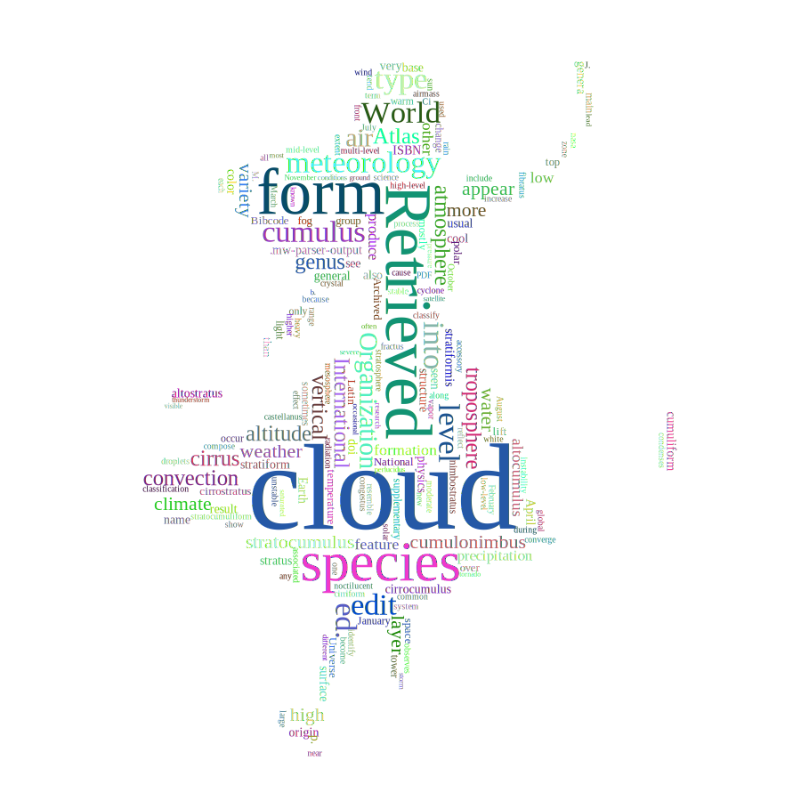

# Sdcb.WordCloud ](https://nuget.org/packages/Sdcb.WordCloud)

**[English](README.md)** | **简体中文**

**Sdcb.WordCloud** 是一个多功能、跨平台的库，用于根据词频生成文字云图片、`SVG`或`JSON`数据。它利用`SkiaSharp`进行图形操作，确保了高性能和质量，而不依赖于`System.Drawing`。这使得它成为在各种平台上运行的应用程序的绝佳选择，包括GUI库可能不可用的服务器端场景。

## 主要特性

- **跨平台兼容性**：在不同操作系统上工作，无需依赖于`System.Drawing`。
- **多种输出格式**：支持生成图片、SVG或JSON数据的文字云。
- **灵活配置**：通过各种选项自定义您的文字云，包括文本方向、字体和遮罩。
- **开源**：在MIT许可下自由提供，欢迎贡献和修改。

## 安装

要在项目中开始使用`Sdcb.WordCloud`，请通过NuGet安装：

```bash
dotnet add package Sdcb.WordCloud
```

## 使用示例

以下是一些展示Sdcb.WordCloud库不同功能的示例。注意：演示使用共享的词频列表，如方法`MakeDemoScore()`所提供的，所有代码都使用了C# 12的语法。

### 示例1：不同文本方向

该示例演示了创建具有5种不同文本方向的文字云。

```csharp
void Main()
{
    TextOrientations[] orientations = 
    [
        TextOrientations.PreferHorizontal, // 默认
        TextOrientations.PreferVertical, 
        TextOrientations.HorizontalOnly,
        TextOrientations.VerticalOnly, 
        TextOrientations.Random,
    ];
    foreach (var o in orientations)
    {
        WordCloud wc = WordCloud.Create(new WordCloudOptions(600, 600, MakeDemoScore())
        {
            TextOrientation = o,
        });
        byte[] pngBytes = wc.ToSKBitmap().Encode(SKEncodedImageFormat.Png, 100).AsSpan().ToArray();
        File.WriteAllBytes($"{o}.png", pngBytes);
    }
}
```


### 示例2：将文字云转换为JSON并反转

生成文字云，将其转换为JSON，然后重构它，以展示操作文字云数据的灵活性。

```csharp
void Main()
{
    WordCloud wc = WordCloud.Create(new WordCloudOptions(900, 900, MakeDemoScore())
    {
        FontManager = new FontManager([SKTypeface.FromFamilyName("Times New Roman")]),
        Mask = MaskOptions.CreateWithForegroundColor(SKBitmap.Decode(
            new HttpClient().GetByteArrayAsync("https://io.starworks.cc:88/cv-public/2024/alice_mask.png").GetAwaiter().GetResult()),
            SKColors.White)
    });
    string json = wc.ToJson();
    Console.WriteLine(json);

    // 可以从生成的json转换回来
    WordCloud wc2 = WordCloud.FromJson(json);
    File.WriteAllText($"json-convert-back.svg", wc2.ToSvg());
}
```

**注意**：此示例说明了文字云数据可以如何存储在JSON中并从JSON重构，方便分享和修改。


### 示例3：应用遮罩

创建一个带有遮罩的文字云，让单词填充特定形状。

```csharp
void Main()
{
    WordCloud wc = WordCloud.Create(new WordCloudOptions(900, 900, MakeDemoScore())
    {
        FontManager = new FontManager([SKTypeface.FromFamilyName("Times New Roman")]),
        Mask = MaskOptions.CreateWithForegroundColor(SKBitmap.Decode(
            new HttpClient().GetByteArrayAsync("https://io.starworks.cc:88/cv-public/2024/alice_mask.png").GetAwaiter().GetResult()),
            SKColors.White)
    });
    byte[] pngBytes = wc.ToSKBitmap().Encode(SKEncodedImageFormat.Png, 100).AsSpan().ToArray();
    File.WriteAllBytes($"mask.png", pngBytes);
}
```


### 示例4：使用特定字体

演示如何为文字云生成使用特定字体。

```csharp
void Main()
{
    WordCloud wc = WordCloud.Create(new WordCloudOptions(600, 600, MakeDemoScore())
    {
        FontManager = new FontManager([SKTypeface.FromFamilyName("Consolas")])
    });
    byte[] pngBytes = wc.ToSKBitmap().Encode(SKEncodedImageFormat.Png, 100).AsSpan().ToArray();
    File.WriteAllBytes($"specified-font.png", pngBytes);
}
```


### 示例5：生成SVG输出

展示如何从文字云生成SVG，这对于需要可伸缩性的Web应用程序非常有用。

```csharp
void Main()
{
    WordCloud wc = WordCloud.Create(new WordCloudOptions(900, 900, MakeDemoScore())
    {
        FontManager = new FontManager([SKTypeface.FromFamilyName("Times New Roman")]),
        Mask = MaskOptions.CreateWithForegroundColor(SKBitmap.Decode(
            new HttpClient().GetByteArrayAsync("https://io.starworks.cc:88/cv-public/2024/alice_mask.png").GetAwaiter().GetResult()),
            SKColors.White)
    });
    File.WriteAllText($"json-convert-back.svg", wc.ToSvg());
    //new Svg(wc.ToSvg(), wc.Width, wc.Height).Dump();
}
```



### 共享词频列表

所有示例使用以下词频列表：

```csharp
static IEnumerable<WordScore> MakeDemoScore()
{
    string text = """
        459    cloud
        112    Retrieved
        88    form
        78    species
        74    meteorolog
        66    type
        62    ed.
        54    edit
        53    cumulus
        52    World
        50    into
        50    level
        49    Organization
        49    air
        48    International
        48    atmosphere
        48    troposphere
        45    Atlas
        45    genus
        44    cirrus
        43    convection
        42    vertical
        40    altitude
        40    stratocumulus
        38    high
        38    weather
        37    climate
        37    layer
        36    cumulonimbus
        35    appear
        35    variety
        34    more
        34    water
        33    altocumulus
        33    feature
        33    low
        31    formation
        31    other
        28    precipitation
        28    produce
        27    .mw-parser-output
        27    name
        27    surface
        27    very
        26    base
        25    April
        25    ISBN
        25    also
        25    origin
        24    cirrocumulus
        24    color
        24    cool
        24    stratiformis
        24    stratus
        23    Earth
        23    structure
        22    altostratus
        22    cumuliform
        22    doi
        22    genera
        22    physics
        22    result
        22    see
        22    stratiform
        22    usual
        21    general
        21    p.
        21    seen
        21    temperature
        21    than
        20    polar
        20    space
        20    top
        19    Bibcode
        19    National
        19    cirrostratus
        19    fog
        19    lift
        19    mostly
        19    over
        18    Archived
        18    Latin
        18    Universe
        18    group
        18    sometimes
        18    supplementary
        18    tower
        18    warm
        17    January
        17    change
        17    light
        17    main
        17    nimbostratus
        17    occur
        17    only
        17    stratocumuliform
        17    unstable
        17    wind
        16    associated
        16    cause
        16    global
        16    instability
        16    mid-level
        16    nasa
        16    new
        16    noctilucent
        16    range
        16    science
        16    show
        16    tend
        15    accessory
        15    any
        15    cirriform
        15    droplets
        15    during
        15    extent
        15    multi-level
        15    near
        15    one
        15    rain
        15    reflect
        15    stratosphere
        15    used
        14    J.
        14    October
        14    PDF
        14    airmass
        14    become
        14    common
        14    converge
        14    crystal
        14    cyclone
        14    front
        14    high-level
        14    observes
        14    stable
        14    system
        14    white
        13    all
        13    along
        13    because
        13    classify
        13    each
        13    fibratus
        13    higher
        13    identify
        13    increase
        13    large
        13    mesosphere
        13    sun
        12    castellanus
        12    classification
        12    compose
        12    condenses
        12    congestus
        12    effect
        12    fractus
        12    heavy
        12    include
        12    low-level
        12    moderate
        12    process
        12    radiation
        12    resemble
        12    solar
        12    term
        12    vapor
        12    zone
        11    August
        11    Ci
        11    February
        11    July
        11    M.
        11    March
        11    November
        11    b.
        11    conditions
        11    different
        11    ground
        11    known
        11    lead
        11    most
        11    occasional
        11    often
        11    perlucidus
        11    pressure
        11    research
        11    satellite
        11    saturated
        11    severe
        11    storm
        11    thunderstorm
        11    tornado
        11    visible
        """;

    return text
        .Split("\n")
        .Select(x => x.Trim().Split("\t"))
        .Select(x => new WordScore(Score: int.Parse(x[0]), Word: x[1]));
}
```

## 许可证

Sdcb.WordCloud是在MIT许可下的开源软件。